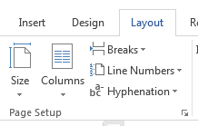
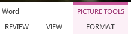
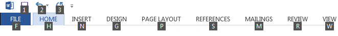
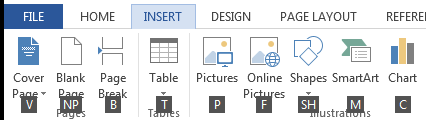
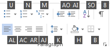
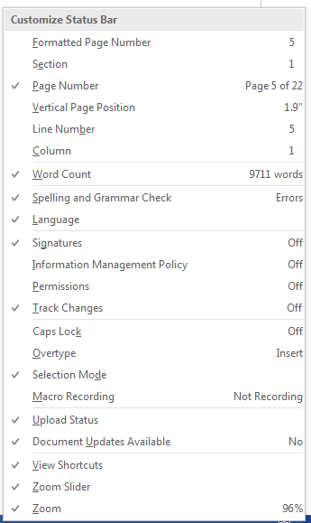
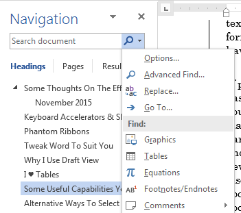

Microsoft Word is the *de facto* writing tool. I like to learn the “ins
and outs” of the tools I use heavily, and wanted to share things I’ve
found helpful in using Word effectively. This paper captures various
thoughts, ideas, and suggestions, as well as pointers for digging much
deeper than this and really become a Word power user, if you’re so
inclined. This is in the spirit of “you won’t use it if you don’t know
it’s there”. These ideas are applicable to all document types, but by
their nature the benefit of applying them increases as document size,
complexity, and editing time increase. I find it beneficial, however, to
make a habit of using styles and other good formatting practices even
for very short documents because it makes things very predictable.

I’m currently using Word 2016 on Windows 7. I’ve built up this knowledge
over time since using Word 97 (starting from a wonderful book by called
*Word 97 Annoyances*; Woody Loenhard, one of the authors, remains an
excellent source of MS Office information to this day). The details have
changed as Word has evolved, but the mindset for how to get the most out
of the program stays the same. Your mileage may vary. I’d also note that
much of what’s in here about Word (e.g., keyboard shortcuts) can also be
applied with just a little adaptation to many Windows applications,
especially the other components of Microsoft Office.\[1\]

I feel obliged to make one “soapbox” comment:

> Modern word processors, like Word, aren’t typewriters. If you use a
> word processor like a typewriter, you will get frustrated. If you
> learn to use its capabilities as intended, you’ll reduce your
> frustration.\[2\] If you right-click on things in Word, explore the
> ribbons, explore the settings, really look at *all* of the controls
> and settings in a dialog box, etc., you’ll discover lots of useful
> features.\[3\] The capabilities available in Word are truly amazing,
> and it’s fun to discover new tricks, so it’s worthwhile to explore.

OK, off the soapbox.

I hope someone finds this of value, and I’m happy to take suggestions
for improve­ments that anyone may have. My thanks to folks who’ve
provided suggestions on previous versions of this document. It’s grown
over time, but I’ve tried to keep it from turning into a book.

David Lemire

dlemire60+word @ gmail.com

# Table of Contents

This TOC gives an overview of what’s covered herein. It’s entirely
reasonable to jump around if certain topics catch your eye. But I’ll be
disappointed if you entirely skip the keyboard shortcuts stuff; you’ll
be missing out\!

[Ribbons and Phantom Ribbons 2](#_Toc471220670)

[Keyboard Accelerators & Shortcuts 3](#keyboard-accelerators-shortcuts)

[Tweak Word To Suit You 5](#tweak-word-to-suit-you)

[Why I Use Draft View 6](#why-i-use-draft-view)

[I ♥ Tables 7](#i-tables)

[Some Useful Capabilities You Might Not Know About
8](#some-useful-capabilities-you-might-not-know-about)

[Alternative Ways To Select Text 10](#alternative-ways-to-select-text)

[Some Really, Really Handy Shortcut Keys
11](#some-really-really-handy-shortcut-keys)

[Formatting Fundamentals 13](#formatting-fundamentals)

[Document Formatting 14](#document-formatting)

[Paragraph Formatting 16](#paragraph-formatting)

[Document Structure: A Key Use of Styles
19](#document-structure-a-key-use-of-styles)

[Document Templates & NORMAL.DOTX 21](#document-templates-normal.dotx)

[Customizing Word 22](#customizing-word)

[Useful Resources 23](#useful-resources)

For starters, here’s a
link to the PDF of Microsoft’s [Quick Start guide for
Word 2016](http://download.microsoft.com/download/1/2/6/1269C192-F79E-4918-B737-D828E0522349/WORD%202016%20QUICK%20START%20GUIDE.PDF),
just it’s easy to get to.

# Ribbons and Phantom Ribbons

Microsoft calls the controls bar across the
top of the page the Ribbon. \[4\] One thing to note about the ribbon is
that each tab (Home, Insert, etc.) is broken into groups, and many
groups have a small arrow at the lower right corner. The Page Setup
group on the Layout ribbon is shown here as an example. Clicking that
little arrow or using its keyboard shortcut opens up a dialog box with
full control over all of the items related to the group, usually
including a number of things that aren’t included on the ribbon. For
example, the full Page Setup dialog has three tabs that provide
additional options such as vertical alignment of the page content (on
the Layout tab in that dialog), which isn’t anywhere on the ribbon.

Something else I’ve noticed people seem to
overlook: With the ribbon interface, Microsoft Office included the
concept of a ribbon that only displays when it’s relevant. Microsoft
calls these “Contextual Tab Sets”, but I just call them “phantom”
ribbons. These ribbons appear when you click on a table or a picture and
offer controls specific to the selected object. At right is an example
of the Picture Tools phantom ribbon appearing when a graphic is
selected.

Selecting one of the phantom ribbons gives you access to a set of
functions specific to the selected object, such as cropping and
recoloring for pictures, or inserting and deleting rows and columns for
tables. Some object types actually have multiple ribbons: tables have
both Design and Layout ribbons (which is why they’re Contextual Tab Sets
(plural)).

The ribbon can be hidden by clicking the little caret symbol at the
lower right of the ribbon area, which yields more screen space for
editing. There’s a control near the upper right of the title bar to
control display of the ribbon (a little box with an up arrow). And you
can use the keyboard shortcut Ctrl-F1 to toggle visibility of the
ribbon.

# Keyboard Accelerators & Shortcuts

While most folks I’ve watched rely heavily on the mouse, I use the
keyboard a lot. It’s probably more accurate to state that I use the
keyboard for everything I possibly can.\[5\] I like the keyboard because
it speeds things up enormously; I’ve lost track of the number of times
I’ve been asked how I did something so quickly and the keyboard is
almost always how. Apparently my brain is well-suited to absorbing
keyboard shortcuts, but I really think most folks can benefit from them.
Using the keyboard is also more *accurate* than mousing around, so it
can also save you time by keeping you from wasting time using the mouse,
not quite getting what you want, and then having to backtrack and try
again.\[6\]

Keyboard accelerators are a significant part of gaining speed with the
keyboard. Pretty much everywhere in Word you can use (tap & release)
Alt, \<letter key\> or (hold) Ctrl‑\<letter key\> to get to a function.
With Word 2016, if you tap the Alt key, you’ll see something like
this:\[7\]

Those letters and numbers in black boxes are accelerators: type Alt, W
and you get the View ribbon, type Alt, N and you get the insert ribbon.
Once you get to a ribbon, the letter boxes there take you to individual
functions. For example, as show below, Alt, N, T equates to
Insert,
Table and brings up the dialog with
different ways of inserting tables.

Accelerators are indicated by black letter
boxes on ribbons and underlined letters in dialog boxes. If there are
lot of functions on a particular ribbon, some functions have a
two-letter accelerator; for example, you can select paragraph alignment
(on the home ribbon) with Alt, (H)ome, AL / AC / AR /AJ, for aligning
left / center / right / justified, respectively (admittedly, these start
to feel a bit clumsy, even to me, but they do let you keep your hands on
keyboard).

Note that you must tap the Alt key and type the ribbon selection letter
even to get to the functions on the currently displayed ribbon. While
that might seem a bit silly, it has the advantage that the key sequence
to reach a particular function is always the same, regardless of what
ribbon is currently displayed. This lets you develop muscle memory for
the things you use a lot.

Some accelerators are hard to see: if the accelerator in a dialog is the
letter “l” (lower case “L”), for example, the underline can be hard to
spot because the letter is so narrow. In some dialogs there are even a
few instances of punctuation marks as accelerators. So they may be hard
to spot, but they’re almost always there.

Throughout this document, underlined letters are the accelerator keys I
see when using Word 2016. Since the ribbon interface was added in Word
2007, sometimes the accelerator letters aren’t part of the label, so for
those I’ve put the letter in parenthesis; for example:
View, Draft (E).

There are also a lot of pre-defined keyboard shortcuts wired into Word
by default (you can change any of these, by the way, or add your own –
see the section later on customiza­tion). Ribbon items that have
pre-defined shortcut keys display them in the tool tip if you hover the
mouse over the icon for that item (e.g., hover over the Find function on
the Home ribbon menu, you’ll get a tool tip that identifies “Ctrl+F” as
the keyboard shortcut for the Find function).

A technique I’ve found useful for memorizing shortcut keys is this: find
the function you want on the ribbon and hover the mouse to get the
shortcut key in the tool tip. Then immediately use the keyboard shortcut
*instead* of clicking on the function. A few times through that and
they’ll start to stick in your brain. Pretty soon you’ll automatically
be typing Ctrl-F when you want to find something.

The ultimate shortcut key, of course, is Ctrl‑Z (Undo).

# Tweak Word To Suit You

Word is highly configurable, and exploring the range of controls
available under File,
Options may help you find places to tweak
behavior that you find annoying. Some configuration tweaks I
particularly recommend:

  - I find most of Word’s automated
    formatting, where Word tries to anticipate what you want and give it
    to you, to be wrong about half the time. Typing Undo (Ctrl‑Z)
    *immediately* after the automated change will fix most of these when
    they happen, but you can turn them off entirely. In Word 2016, this
    is under File,
    Options, Proofing, and the
    Autocorrect Options… button at the
    top of the dialog. The options on the “AutoFormat As You Type” tab
    are where most of the things you want to turn off are located. Most
    of these are pretty obvious. The group in the middle labeled “Apply
    as you type” contains ones I’d particularly recommend turning off.

  - There are quite a few information items that can be displayed on the
    status bar at the bottom of the Word window, many of which are off
    by default. Right-clicking on the status bar displays the list shown
    at right; you can click on individual items to toggle whether they
    appear on the status bar. Some of the items (e.g., the Track Changes
    status) can also be clicked to change their status (e.g., turn
    change tracking on and off).

  - Word stores most of its defaults, including the formatting of a
    “blank document” in a template file called NORMAL.DOTXM; with Word
    2016 on Windows 7, this file is stored under
    C:\\Users\\\<username\>\\AppData\\Roaming\\Microsoft\\Templates. If
    you want a to change the look of the blank document you get from
    File,
    New, you have to open this file,
    adjust its default formatting to what you want the most, and save it
    *as a template*, not a document (see the section later on Templates
    for more details). Note that the AppData folder in Windows has the
    “Hidden” attribute set, which might make it a little hard to find.
    You can type in the path, or you can change the settings in Windows
    Explorer so that Hidden and System folders are visible (I suggest
    doing the latter).

# Why I Use Draft View

OK, this might be a soapbox thing, too. I use Draft view (Alt,
View, Draft
(E)) probably 75+% of the time when using
Word and I think people are missing out by not using it, so here’s some
of the whys and wherefores of Draft view:

  - Draft view is often a more efficient way to work on a document than
    Page Layout / Print Layout view: you don’t waste screen space on
    page headers and footers, you can really concentrate on the content,
    etc. Many people seem resistant to Draft view, preferring to see
    exactly the page layout. My thinking is that if I’m using
    well-constructed styles, etc., page layout pretty much takes care of
    itself and I can defer little tweaks to fix it up until the time I’m
    close to caring about a printed version; that’s when Print Layout
    view comes into play.

  - If you’re using Draft view, you can also turn on the style view
    column on the left-hand side. To get this, select
    File,
    Options, pick the Advanced option,
    scroll down to the Display group, and set the “Style Area pane width
    in Draft and Outline views” value to somewhere around an inch or so.
    Once the pane is visible, you can easily adjust its width with the
    mouse (yes, I do use the mouse sometimes). With the style area pane
    visible, you can now see at a glance how paragraph styles are being
    applied to your document (and I *greatly* encourage learning to use
    styles and doing so routinely), which makes it much easier to
    understand how *and why* things are being formatted the way they
    are. Also, if you’ve got the style view column displayed, a single
    click in that area selects the entire paragraph to the right of
    where you clicked, which is often very handy. Click-and-drag in the
    style view column quickly selects a range of complete paragraphs
    without overshooting or undershooting, making it easy to select a
    big block of text (this is another case of me preferring an approach
    that offers high accuracy, albeit this time with the mouse).

  - Another useful option with Draft view is to set Word to wrap your
    text to the size of the screen (or window), rather than the defined
    margins for the printed page. While this means the word wrapping
    doesn’t match the eventual formatted, printed product (which I
    realize drives some people completely crazy), it also maximizes the
    amount of content you can get on a screen for any given zoom level,
    and it means the text rewraps to fit the screen as you zoom in and
    out, which I think is pretty handy. This is controlled with the
    “Show text wrapped within the
    document window” setting under File,
    Options, Advanced, Show Document
    Content group. I particularly like this when projecting a document
    in a meeting, since you can easily get the text big enough on screen
    for folks to read without any need for horizontal scrolling.

Beyond Draft view:

  - If you really want the Print Layout view but find the page headers
    and footers distracting or space wasting, you can double-click in
    the space between pages on the screen to suppress the display of the
    white space. Double-click on the line between pages again to restore
    display of the headers and footers. This also appears as a control
    option under File,
    Options, Display.

  - It’s not specific to Draft view, but it’s worth knowing that there
    are some handy built-in zoom settings on the View ribbon or if you
    click on the percentage number in the zoom control in the bottom
    right corner. Some of these are only relevant in Print Layout view:

<!-- end list -->

  - “Page width” sets the zoom so that the horizontal width of the page
    fits in the window. (Alt, W, I)

  - “Whole page” sets the zoom so that one entire page fits in the
    window. On the ribbon this is View, One Page (Alt, W, 1 (number
    one))

  - “Text width” sets the zoom so that the horizontal width of the text
    between the margins fits in the window (this one isn’t on the
    ribbon).

# I ♥ Tables

Tables are *the* way to structure data into columns; using tabs to do it
will eventually lead you into a mess (and a rubber room), and content in
table cells is much easier to edit than three or four lines of text that
have been tabbed half-way across the page and wrapped using paragraph or
line breaks (yes, I have seen documents where people did this). Tables
are a great way to organize things like reference document lists,
glossaries and lists of acronyms, among other things. You can use the
Borders control on the Table Design ribbon to make the cell boundaries
invisible so that it’s not visually apparent that there’s a table, but
the underlying table structure makes it a whole lot easier to edit the
information, add new items, sort the content alphabetically, etc. If you
do this, you might want to turn on View Gridlines on the Table Layout
ribbon while editing so you can see where the boundaries are.

Tables are also an excellent way to structure data for forms, signature
blocks, etc. One of the advantages of tables is that you can set table
cells to specific sizes both horizontally and vertically, providing
precise control over the appearance of text on a page and the
relationships among different bits of information.

Here’s example of a signature block made from a one cell-wide by two
cell-high table. The upper cell is set to 0.5” high, and the Borders
control on the Table Design ribbon has been used to place a horizontal
line between the cells for a signature line when this is printed. Here
I’ve also used the Borders control to put a gray dotted line around
the outside of the table to show off its boundaries, but obviously you
wouldn’t usually want that formatting in a real signature block. You can
also use the Properties dialog from the Table Layout ribbon to align
your signature block left, center, or right as you wish for your
document (here it’s centered).

|                                           |
| ----------------------------------------- |
|                                           |
| **David P. Lemire**, General Troublemaker |

That Properties dialog is the place to go for a lot of your table
formatting needs: row height, column width, heading rows, etc.

When moving in a table, the tab key moves you forward by cells;
shift-tab moves you backward. Typing tab when the cursor is in the last
(bottom-right) cell of a table adds an empty new bottom row formatted
the same as the one the cursor was in, and is a quick way to extend a
table. Typing Return in the upper left cell of table at the start of
document inserts a blank, non-table line above the table, as will the
Split Table command on the Table Layout ribbon (Alt, JL, Q).

When formatting a table of any size, it’s usually handy to set the first
row(s) to be headers that repeat, in case the table spreads across a
page boundary. Also, Word defaults to allowing table rows to break
across page boundaries, but I usually turn that off unless I’ve got a
lot of content in a row, since I prefer to keep the content of each
individual row on a single page; look for the checkbox labeled “Allow
row to break across pages” on the Table
Layout, Properties (Alt, JL, O), Row tab
and clear the check to keep your row contents together on a single page.
You can apply this to individual rows, or select the whole table (Table
Layout, Select, Table, (Alt, JL, K, T)) and apply this setting to the
whole thing.

A possible problem solver: If a table isn’t displaying the way you
think, check the row properties Table Layout, Properties (Alt, JL, O),
Row tab to see if the row has been set to
a specific height. If so, turning that off may help your problem. (Same
holds for column properties, but you’re more likely to want to lock
those to particular widths than you are rows to a particular height.)

# Some Useful Capabilities You Might Not Know About

*Paste Special.* Normally when you paste text and graphics, Word
attempts to retain the text’s formatting information or embeds the
graphic as an “object” that can be edited in its native application
(e.g., PowerPoint) by double-clicking on the object. There are times
that default behavior gets in the way, rather than helping you. When
this happens, undo (Ctrl-Z) the paste operation and look at the options
under Alt, Home, Paste (V),
Special for alternatives. Pasting as
“unformatted text” is often handy when you’re moving text from one
document to another and you want the next text to conform to the
formatting in the destination document. The options under Paste Special
vary depending on what you’re pasting (e.g., having text vs. graphics in
the clipboard gives a very different list when you invoke Paste
Special).

*Paste Text Only*. One of the most useful options under Paste Special is
Paste Text Only (also available at the top level of paste: Alt,
Home, Paste (V),
Text only). Normally, Windows does its
best to preserve the format of things as you copy and paste within or
among different applications. Sometimes that’s great, sometimes you’re
rather let the program into which you’re pasting control the formatting.
Paste Text Only also has another great use as a problem solver.
Sometimes, no matter what you do, you can’t get Word to format something
the way you want; somehow, the formatting history of a paragraph or some
underlying document file corruption gets in the way. When this happens,
create a blank paragraph and apply the Normal style to it. Copy the text
you’re trying to fix from the problem document, then Paste Text Only
into the new paragraph. Now format the new paragraph the way you want
it, and delete the old one. In the most extreme case, it’s also possible
to copy an entire document’s contents and Paste Text Only into a new,
blank document if the overall document formatting is really scrambled.
That’s something of a desperation measure, but it can save a lot of
retyping if a document can’t be repaired any other way.

*Convert Text to Table.* I love this one and use it frequently: A really
quick way to create a table structure is to type the column headers you
need separated by tabs. Don’t worry if this runs past a single line of
text, just type column name, \<Tab\>, column name, \<Tab\> until you’ve
got them all. Then select the line(s) of text you just typed and invoke
Alt, Insert,
Table,
Convert Text to Table (Alt, N, T, V);
specify to separate text at Tabs and you’ll quickly have a table with
the columns you defined. You can then tweak the columns widths, format
the text, etc. For example, if I type:

Name\<tab\>Address\<tab\>City\<tab\>State\<tab\>Zip

and then convert text to table as described above, I’ll wind up with:

|      |         |      |       |     |
| ---- | ------- | ---- | ----- | --- |
| Name | Address | City | State | Zip |

I can then place the cursor in the last cell, hit the tab key to create
a blank next row, and I’m ready to start capturing an address list.

*Navigation Pane*.\[8\] If you’ve formatted your document using Heading
styles for your section and subsection headings, the Navigation Pane
(View, Navigation Pane (Alt, W, K) will (1) quickly show you the
document structure, and (2) let you jump to any heading in the document
by clicking on it in the headings list. Try it with this document:
Select View, Navigation Pane (K) from the
menus, makes sure Headings is highlight (click if needed, or the tab key
will move you around the various part of the Navigation Pane) and the
structure of the document will appear on the left side of the screen
based on heading styles. Click on any heading in the Navigation Pane and
the document view will jump to that point. This is enormously handy for
quickly navigating around a big document.

*Drag’n’Drop A Copy.* You probably know that if you’ve got text
selected, you can drag and drop with the mouse to move it. But if you
hold down the Ctrl key while you drag and drop, you drag and drop *a
copy* of your text*.*

*Reveal Formatting*. Sometimes you just need the details of how the
thing you’re looking at is formatted; thankfully, Word can do that.
Typing Shift-F1 toggles the visibility of a Reveal Formatting pane on
the right side of the window. This will show the formatting of the text
at the cursor, including font, paragraph, and section settings. The
paragraph list also indicates what paragraph style has been applied,
making it easy to see the style and outline level of the current text.

*Search for Formatting*. When you search
(Ctrl-F) Word will show the Navigation Pane and place the cursor in the
Search Document field. At the right edge of that field is a magnifier
icon and a tiny triangle. Clicking on that triangle exposes a number of
advanced search options that can help you find what you want more
quickly. If you pick the “Advanced Find” button in that list, you get
the full Find and Replace dialog. Clicking the
More button there exposes more search
features, one of which is formatting. You can search for text formatted
in particular ways or with a particular style. If you leave the
“Find what:” field empty, Word will
find any text with the formatting you specify.

*Wildcard Searches*. Another thing the “More” button exposes is a button
labeled special, which lets you search for things like tabs and
paragraph breaks. There are also wildcards like “any digit”, so you
could search for 3-digit numbers by using three “any digit” wildcards in
a row as your find text (the wildcards can also be typed directly, like
^\# for any digit). With a little thought, you can specify very
precisely what you want to find, or create a wildcard search that will
get all variants of something you’re looking for.

# Alternative Ways To Select Text

Selecting text is a frequent operation, since you select text so you can
format it, delete it, copy (or cut) and paste it, etc. You can always
select text with the mouse, and you can hold down the Shift key and use
the cursor keys to move the cursor, selecting text as you go. But there
are some other alternatives that can be really helpful and easier than
these, particularly when selecting large amounts of text. One of these
is selecting paragraphs by clicking in the Style Area pane, as described
above. There are a couple of other useful ones:

*Extended Select Mode.* Pressing F8 enters extend text selection mode;
you can then use cursor keys, page up / page down, etc. to select a
range of text. This is a lot more controllable than scrolling with the
mouse pointer at the top and bottom edges of the screen (that may have
worked fine in the days of Pentium processors, but on a modern computer
it’s like trying to steer a horse galloping at warp speed).

Typing F8 followed by a character selects all of the text from the
cursor to the next occurrence of that character. So, to highlight all of
“\[this is just a note tucked in the text\]” if the cursor is before the
open bracket “\[“, type F8 followed by a closed bracket “\]”. So hitting
F8 followed by the return key selects everything from the cursor up to
and including the ending paragraph break of the paragraph you’re in.

Another use of F8 is hitting it sequentially to select more and more
text. Hit F8 once to enter selection mode (as described above). Hit it a
second time to select the current word. Third and fourth hits select
sentence, then paragraph. Using Shift-F8 reverses the process, reducing
the size of the selection. Hitting ESCape gets you out of selection mode
entirely. The text you’ve selected up to the time you hit ESCape is
still selected; you can take action on the selected text, or just move
the cursor and go on to something else, unselect­ing the text in the
process.

*Column Select With The Mouse*. Holding down the Alt key while you click
and drag allows you to select a *column* of text, regardless of wrapping
and paragraph / line breaks. This can be parti­cularly useful when
cleaning up imported text.

*Select Table Columns or Rows*. Clicking to the left of a table row
selects the whole row. Hovering at the top of a table column will change
the mouse cursor to a small down arrow; clicking then will select that
table column.

# Some Really, Really Handy Shortcut Keys

You can do most everything with the mouse but you can also do most
everything with the key­board and it can be a *lot* faster. The
following list is based on the principle that it’s worth learning a few
keyboard shortcuts to gain a notable amount of efficiency. If you want a
complete list, an article at Laptop Magazine’s website explains how to
[get a list of all Word keyboard
shortcuts](http://www.laptopmag.com/articles/see-all-word-keyboard-shortcuts)\[9\].

  - Don’t neglect the basic Windows shortcuts for cut, copy and paste,
    as these alone can save a lot of time:

<!-- end list -->

  - Ctrl-x cuts the selected text to the clipboard.

  - Ctrl-c copies the selected text to the clipboard.

  - Ctrl-v pastes the clipboard to the document, replacing any text
    that’s selected.

<!-- end list -->

  - Ctrl-z is undo / Ctrl-y is redo (as in, reverse the undo operation
    just performed).

  - Ctrl-p brings up the print dialog for the current document.

  - F4 repeats the last action, which gives, for example, a quick way to
    apply a style selection to a bunch of non-contiguous paragraphs.

  - Shift-Ctrl-Space enters a non-breaking space (sometimes called a
    hard space). Great for keeping “Volume 2” together on a line. Much
    preferred to the use of a line break (Shift-Enter) before “Volume”
    (in this example) because it will allow paragraph wrapping to
    proceed normally when the text changes. Non-breaking spaces show up
    as a little raised circle instead of a dot if you’ve got
    non-printing characters displayed.

  - Shift-Ctrl-Hyphen enters a non-breaking hyphen (sometimes called a
    hard hyphen). Great for keeping “auto‑format” together on a line.
    Ditto on how this is better for rewrapping.

  - Typing Control-Hyphen inserts a condition hyphen, which can clean up
    wrapping if a really long word (e.g.,
    supercalifragilisticexpialidocious \[sp?\]) appears at the end of a
    line.

  - Ctrl-K brings up a dialog for you to assign a hyperlink to the
    currently selected text.

  - Ctrl-\<arrow key\> moves you by:

<!-- end list -->

  - Words forward and backward (left and right arrows)

  - Paragraphs forward and backward (up and down arrows); note that this
    works a little oddly in a bullet list, as Word seems to consider the
    bullet as its own paragraph separate from the text associated with
    the bullet

<!-- end list -->

  - Ctrl-Shift-\<arrow key\> moves by word / paragraph, selecting the
    text as you go.

  - Ctrl-Del deletes by words going forward.

  - Ctrl-Backspace deletes by words going backward.

  - Shift-F3 toggles the word your cursor is in (or the currently
    selected text) through lower case, Title Case, ALL CAPITALS, and
    back to lower case.\[10\]

  - Shift-F1 toggles visibility of the Reveal Formatting pane.

  - Ctrl-Shift-8 (or Ctrl-\*, if you prefer) toggles the display of
    hidden formatting (e.g., tabs, spaces, paragraph breaks). This gives
    you, for example, a quick way to see whether a line ends with a
    paragraph break or a line break and then turn that display back off.

  - Control-Shift-E turns revision tracking on and off. This is handy if
    you don’t care to track fixing a simple typoo (oops, typo) but do
    want to track significant revisions, because it gets you into and
    out of change tracking mode *very* quickly. There’s an indicator in
    the status bar at the bottom that shows “Track Changes: On” if
    change tracking is turned on. If you really just have to use your
    mouse, you can click on the status bar indicator to turn change
    tracking on and off, which is still a lot faster than going through
    the menus to get there.

  - Alt-Shift-\<arrow key\> moves a paragraph either hierarchically
    (left / right) or linearly (up / down) through the document; there’s
    no need for selecting text, just have the cursor in the paragraph
    you want to move:

<!-- end list -->

  - Alt-Shift-Left/Right promotes and demotes paragraph headings (e.g.,
    Alt-Shift-Right Arrow would convert a paragraph with a “Heading 2”
    style into one with a “Heading 3” style). This works in any view,
    but is easiest to see and play with if you switch to Outline view
    temporarily.

  - Alt-Shift-Up/Down change the order of paragraphs (e.g., Alt-Shift-Up
    Arrow would move the current paragraph before the previous one).
    Most of the time this works great; occasionally it gets glitchy (I
    haven’t been able to work out a reason why or the pattern of when it
    doesn’t do what I want/expect), so watch your results when you do
    it. Use Undo (Ctrl-z) right away (multiple times if necessary) if
    you didn’t get the results you intended and use cut/paste to do your
    paragraph move instead (while you growl under your breath at
    Microsoft).

<!-- end list -->

  - There are several useful search and replace shortcuts:

<!-- end list -->

  - Control-F invokes the Find (search) dialog, which in Word 2016 shows
    up in the Navigation Pane at the left (the pane appears when you
    type Control-F if it isn’t already displayed)

  - Control-H invokes the Find and Replace dialog (in this case you get
    the dialog, not the Navigation Pane)

  - Control-Page Up / Page Down search forward and backward for the
    current search term if you moved the cursor out of the Navigation
    Pane search field. So, to find the first instance of what you’re
    looking for, hit Control-F, type in your search term, and hit Enter.
    At that point either hit Escape or click with the mouse to get the
    cursor into the document, and search for further instances by typing
    Control-Page Down. You can jump back to previous instances of the
    term with Control-Page Up, much more quickly than you can change
    your search direction from down to up in the find dialog.

<!-- end list -->

  - If you have more than one document open, Ctrl-F6 key swaps among
    documents (and Shift‑Ctrl‑F6 does so in the reverse order).

  - If you have more than one “pane” open (e.g., you’ve split the
    screen, you’ve got the comment editing pane open, you’ve got the
    footnote editing pane open), the F6 key swaps the cursor between
    panes. Sometimes it can be hard to see what pane you’ve switched
    *to*.

  - Keys that create paragraph / line / page breaks:

<!-- end list -->

  - Enter terminates a paragraph and creates a new one.

  - Shift-Enter inserts a line break, but the text before and after the
    line break are still the same paragraph, which is important to
    understand when applying paragraph formatting (this is discussed in
    more detail below).

  - Ctrl-Enter inserts a page break, which (oddly) has the same
    paragraph style as the paragraph you were in when you created it.

<!-- end list -->

  - If you have text selected, you can quickly increase or reduce its
    font size using Ctrl‑Shift‑\> and Ctrl‑Shift‑\< (those are the
    greater than / less than symbols).

  - Ctrl-Q returns selected text to the formatting defined by the
    underlying paragraph style.

  - Ctrl-space removes direct formatting (bold, italic, etc.) from
    select text and returns it to the text formatting defined by the
    underlying paragraph style.

# Formatting Fundamentals

Formatting is both one of Word’s greatest strengths and one its greatest
sources of frustration, partly because it’s mostly but not quite
completely consistent. I’m going to tackle it by looking at it three
ways:

  - *Document formatting*, which is where you control things like
    margins, columns and headers and footers; that is, things the
    control the look and layout of the page. Documents can be broken
    into sections, and these aspects of page formatting can vary among
    sections.

  - *Paragraph formatting*, where you control things like indents,
    justification, line spacing with, before and after paragraphs, and
    some aspects of page breaks.

  - *Structural formatting*, where you use Heading styles give a
    document hierarchical structure (sections, subsections,
    sub-subsections, and so forth), plus the use of styles in general to
    make all of this easier and more consistent.

Word stores formatting *with* the item it applies to: the document,
section, or paragraph. To really *get* Word formatting, you have to
think in terms of formatting a section or paragraph as a thing, rather
than in terms of inserting a formatting code at a particular location in
the document.\[11\]

## Document Formatting

Document formatting controls what pages look like overall. This is where
you format paper sizes, portrait/landscape orientation, margin widths,
and a number of other items pertain to the overall look of a printed
page. Document level formatting is mostly found in the Page Setup group
of the Layout (P) tab of the Word ribbon. If you need to have different
page layouts for different parts of the same document, you set that up
by breaking the document into “sections” (using one of the section break
types under Layout (P), Breaks), then
formatting each section as desired. Note that section breaks are mostly
invisible unless you’re either in Draft view or you turn on one of the
options to show hidden formatting. The figure below shows the way
sections make up a document and the list afterward tells where to find
the various aspects of document/section formatting when you need them.

  - 
  - **Layout Tab**
    
      - Margins
    
      - Page Orientation
    
      - Page Size
    
      - Columns
    
      - Line Numbering
    
      - Section Breaks
    
      - Vertical Alignment (in full Page Setup dialog under Page Setup
        group)

  - **  
    Insert Tab**
    
      - Headers and Footers
    
      - Page Numbers

  - **Design Tab**
    
      - Page Borders
    
      - Background Color
    
      - Watermarks
    
      - Predefined document styles

So, if you want your new document’s title, date, version, etc., to be
vertically centered on the front page you’d set that using the Layout
tab of the Page Setup dialog, accessed through the Page Setup group on
the Layout ribbon (Alt, P, SP). To have the rest of the document then
aligned to the top of the page, you insert a section break of the “next
page” type after the cover page material, and then format the new
section accordingly, again using the Page Setup dialog. Section breaks
are inserted using Layout (P), Breaks;
you have the option of making the new section also start on a new page
by picking the appropriate section break.

If you select some text and apply certain kinds of formatting (e.g.,
making a part of your document 2-column), Word will automatically insert
“continuous” section breaks around that section.

Note that these sections are a Word thing for specifying the page
formatting of your document. They have no
relationship whatsoever to Sections, Chapters, Volumes, etc., in
a document structure / table-of-contents sense. In other words, they
pertain to the structure and appearance of the Word document *file*
rather than the structure of your document *content*. The document file
section can be displayed on the status bar in the lower left corner next
to the current page number. You can also print a single section by
picking “Pages” in the print dialog and entering “s*x*” where “*x*” is
the section number you want to print.

Line numbering (enormously useful for document review) is under Layout
(P), Line Numbers (LN), which includes control over if and where line
numbering gets reset. Unfortunately, that doesn’t give you control over
the appearance of your line numbers, that’s set with the “Line Number”
style. Change that style to change the look of line numbers. The default
“Line Number’” style is simply the default paragraph font and size
specified in the Normal style; I prefer line numbers to be smaller than
my text so they’re less obtrusive. Since sans-serif fonts are more
readable in small sizes, I will typically set the font formatting of the
Line Number style to something like 8-Point Arial, Calibri or Verdana.

## Paragraph Formatting

Paragraph formatting is a group on the Home menu. The basic options are
there; for complete control you’ll need the paragraph formatting dialog
(Alt, Home, Paragraph (PG), or
right-click in the text you want to alter and pick Paragraph). Paragraph
formatting controls the appearance of the paragraph, and the flow of
paragraphs with regard to page breaks. The figure below shows how the
features of the Paragraph dialog Indents
and Spacing tab control the format of paragraphs with regard to the
overall page format established using the Layout, Page Setup functions.

Paragraph formatting information is effectively stored in the little
paragraph symbol (the reversed-P thingy: ¶) at the end of the paragraph.
These appear when you click the Home ribbon’s “Show/Hide” button that
has the ¶ symbol on it (or type Ctrl‑Shift-8). One implication of the
fact that the formatting is in the end of paragraph mark is that when
you’re trying to copy or move a complete paragraph, you have to do two
things to get it right:

1.  Select all of the paragraph, *including* that ending paragraph
    symbol. If you don’t have hidden items displayed, this means that to
    be sure you have to include the apparent space after the last
    character in your text (a little harder to be sure about if you have
    any actual trailing spaces).

2.  Copy or Cut the selected text, then place the cursor *at the very
    beginning* of the first line of the paragraph *before which* you
    want the pasted text to appear, then paste.

This is one of those operations where the ability to select a whole
paragraph in Draft view comes in really handy.

Because it’s important to know where the paragraph marks are in order to
keep track of the how’s and why’s of your document’s formatting, it’s
extremely helpful to turn on the display of paragraph marks. You can do
this by clicking the “Show/Hide” button, but that also turns on the
display of spaces as dots, which adds distracting screen clutter. A
better approach is to go to File,
Options, select Display and check
“Paragraph marks” in the Formatting
marks group. Turning the view of tabs here can also be very helpful.

I can’t emphasize enough how using the Spacing
Before or Spacing
After aspect of para­graph formatting (on
the Indents and Spacing tab) is a much
better way of creating open space between paragraphs than either blank
lines (which are really empty paragraphs) or line breaks (Shift-Enter)
that don’t create a new paragraph. This is one of those places where not
using Word as a typewriter really pays off in it taking less effort to
create your document, in formatting it consistently, and in making it
easier to update. For most things, I find it simplest to use the Spacing
After setting to create a 6-point (1/2 line) space after each paragraph.
This gives a nice, easily-readable layout without wasting a lot of space
(this is, by the way, the default formatting of the Body Text style
that’s a standard part of several different document templates
supplied with Word).

The Line and Page Breaks tab of the
paragraph formatting dialog includes two options, “Keep With Next” and
“Keep Lines Together”, that are important to managing pagination, but
easy to confuse. Checking the Keep With Next option tells Word “keep
this paragraph together on the same page with the paragraph that follows
it.” In contrast, checking the Keep Lines Together option tells Word
“keep all of the lines of this paragraph together on the same page.”
Used correctly, these formatting options, along with the “Page Break
Before” setting, makes getting appropriate pagination pretty much
automatic, versus the pagination gotchas that you’ll almost inevitably
have to go back and fix if you use either a bunch of blank lines (Enter)
or manually entered hard page breaks (Ctrl-Enter) to control where page
breaks occur.

One important dimension of this concerns keeping section headings with
the text they label. If your document contains a heading, followed by a
blank line, followed by the first paragraph in the section, then an
automated page break can fall between the heading and the text, even
when the heading style has the Keep With Next formatting attribute set.
The result is that your heading will be at the bottom of one page and
the text it heads on the top of the next.\[12\] If the Spacing After
method is used instead of a blank line, then Keep With Next will keep
the heading and the content together, separated by the specified
spacing. This concept is illustrated in the following figure.

## Document Structure: A Key Use of Styles

What is a style? A paragraph style in Word establishes virtually every
aspect of paragraph formatting, either directly (that is, because you
set it in the style), or indirectly (because it’s defined in the style
that the style you’re specifying is “based on”). So, for example, the
Normal style (which is the foundation for pretty much all others) may
have the font set to 11‑point Calibri (the modern Word default). From
there, you might create two styles based on Normal: one for section
headings that you set to 14-point bold, and one for body text with the
first line indented and a 6‑point space after. If you later decide you’d
rather have your document in Century Schoolbook than Calibri, all you
have to do is change the font selection in the Normal style. Your
heading and body text styles will change typeface accordingly because
they’re based on Normal, but keep their own additional formatting. While
this maybe sounds a bit confusing and intimidating at first, once you
play with it a little bit I think you’ll find it makes sense.\[13\]

One good reason to care about styles is that if you’ve got a Word
document of any length, you probably want to have sections or chapters,
and subsections, and maybe a table of contents. To automate this, *by
far* the easiest way is to format your section headings with
appropriately defined Word styles.

An important related concept: bring up the paragraph formatting dialog
(Alt, H, PG) and take a look at the Indents and Spacing tab. In the
upper corner there’s a control labeled
“Outline level”. Each paragraph is
either associated with a level of document structure from 1 to 9 or is
identified as “Body Text”. So these outline level settings are used to
identify section headings from most significant (Level 1) to least
(Level 9). Every paragraph that’s not a heading should have an outline
level of body text. (By the way, if some of your text that isn’t a
heading is showing up in the table of contents or navigation pane, you
need to go fix that paragraph’s outline level).

Word’s built-in Heading styles make this easy. Heading styles are your
friend: by formatting your section headings with the Heading 1 through
Heading 9 styles, as appropriate, they give a document structure, and
make the navigation pane and the outline view useful. They also
facilitate section numbering, table of contents creation, and the
insertion of automated cross-references between sections. If the look of
the various headings isn’t your cup of tea, all of it can be changed for
the whole document by altering the font, paragraph, and other formatting
attributes *of the style*. For example, the Heading 1 style in this
document has had its font changed to Cooper Black, and the color changed
to 80% gray. For fun, go change the heading style and you’ll see all the
section headings change accordingly. There are also some built-in design
themes on the Design ribbon that will adjust the paragraph styles *en
masse* to alter the look of your document.

One of Word’s features is the ability to have the definition of a style
automatically update when you directly format a paragraph of that style.
In my view, the Automatically Update feature of Style definition is
***not***\[14\] your friend, *except*
when you are first building the set of styles for a document template
file. If Auto Update is checked, a minor formatting tweak in one place
in your document can wreak havoc with the whole thing, and you may not
notice until you no longer remember what you did. The most outrageous
case is if Automatically Update is set on the Normal style: make one
paragraph in your document italic, or red, or a different font, and
suddenly your whole document is italic, or red, or in a different font,
since virtually every other style is based directly or indirectly on the
Normal style. In the style formatting dialog there’s a check box for
“Automatically Update”; you’ll want to
uncheck that box so that your styles don’t go changing willy-nilly.

Learning about paragraph styles is *really* worthwhile. An excellent
reference is a column by Woody Leonhard called [*Word Styles from the
Beginning*](https://office-watch.com/2015/word-styles-from-the-beginning/).
Microsoft also has some videos on the topic on page about [Using Styles
in
Word](https://support.office.com/en-US/Article/Using-Styles-in-Word-9db4c0f4-2754-4294-9758-c14a0abd8cfa).

A few other appearance things are handled by special styles. I mentioned
the Line Number style in the section on document formatting. Another one
you might want to tweak is the Hyperlink style, which defaults to
underlined blue text when you type an Internet URL. You can easily
change the look of this by modifying the Hyperlink style. By the way, if
you’d rather Word didn’t automatically convert URLs to hyperlinks, you
can turn that off under File, Options, AutoCorrect Options, Autoformat
As You Type tab, uncheck the “Internet and network paths with
hyperlinks” option.

# Document Templates & NORMAL.DOTX

Another confusing aspect of Word is document templates. The basics are
as follows:

1.  Template files have a .DOTX extension (in older versions, it’s .DOT;
    if the template also contains macros it will be .DOTM). Normal
    documents have a .DOCX extension.

2.  If you double-click on a template file in Windows Explorer, you’ll
    get a new blacnk document in Word based on that template (basically,
    just a copy of the template that you’ll have to Save As a document).
    If you want to *edit* a template file, you’ll have to launch Word,
    and use File,
    Open, Browse (O) to find and open the
    template you want to change. You can change the files type setting
    to All Word Templates (\*.DOTX, etc.) to just see templates.

3.  All of your basic Word program settings and the format of a basic
    “blank document” are stored in a template file called NORMAL.DOTX.
    This template is automatically loaded when you start Word, even if
    you’re opening a file or have double-clicked on another template, in
    order to get all of those settings.

4.  Any customizations you’ve made to Word are, by default, also stored
    in NORMAL.DOTX.

<!-- end list -->

3.  A new document can be based on a template other than Normal. When
    you do that, the settings in the selected template, including any
    style definitions, boilerplate text, etc., are added onto the
    settings from NORMAL.DOTX. The selected template’s settings override
    corresponding ones in NORMAL.DOTX (e.g., if the Heading 1 style is
    different, the template’s version takes precedence). The important
    stuff from the selected template is incorporated into your new
    document. It’s important to know that once the document is created,
    there is *no further connection* between your new document and the
    template on which it was based. If you modify that template later,
    it won’t affect any existing document(s) based on that template.

<!-- end list -->

5.  You can force Word to load templates in addition to NORMAL.DOTX when
    it starts up, but that’s something of an advanced customization
    thing that many people won’t need. Some third-party programs add in
    such templates when they’re installed in order to add features to
    Word.

By default, on a Windows 7 and above system the NORMAL.DOTX template is
stored in the \\Documents and Settings\\ folder, under the user’s name.
So on my system, it’s in:

C:\\Users\\\<username\>\\AppData\\Roaming\\Microsoft\\Templates

Depending on how your system is set up, the Documents and Settings
folder may be on a different drive, but in any case that’s almost
certainly where your NORMAL.DOTX template will be found.

For basic use of Word, you’ll probably find you can make a few
modifications to NORMAL.DOTX/.DOTM to set the defaults for a blank
document to something appropriate for your use, and then not worry about
it very much. If you routinely create documents of each of several
different types, it may save you a lot of effort to create a template
for each. There’s an excellent and very thorough article on how to
create a template available at the Word “Most Valuable Professional” web
site.\[15\] Microsoft also has a bunch of templates that shows up when
you do File, New; if you pick one of them you’ll get the opportunity to
download it and add it to your Word setup. A well-crafted template
definitely makes creation of consistently formatted documents easier.

# Customizing Word 

Along with frequently offering two, three, or more different ways to do
most everything, Word is also extraordinarily customizable. At the most
basic level, you can very easily adjust the content of ribbons to have
the stuff you actually use conveniently available (either right-click on
the ribbon background and pick “Customize the
Ribbon …” or select Alt,
File,
Options, Customize Ribbon). The details
are explained in a Microsoft article [Customize the Ribbon in
Office](https://support.office.com/en-us/article/Customize-the-ribbon-in-Office-00f24ca7-6021-48d3-9514-a31a460ecb31).
You can also easily assign your own keyboard shortcuts for instance
access to functions you use frequently (the button to customize keyboard
shortcuts is in the Customize Ribbon dialog (bottom left corner)).

At the upper left of the Word title bar is the “Quick Access Toolbar”.
You can get to options to customize it similarly to those for the
Ribbon. Microsoft also has a [page about
that](https://support.office.com/en-us/article/Customize-the-Quick-Access-Toolbar-43fff1c9-ebc4-4963-bdbd-c2b6b0739e52).
It’s important to know that to add commands to a ribbon you have to
first add a “custom group” within the ribbon to hold those commands (you
can customize ribbons but not built-in groups). The Quick Access Toolbar
has no concept of groups, so they aren’t needed to customize that.

In the customization dialogs for both the Ribbon and the Quick Access
Toolbar, there is a pull-down called
“Choose Commands From:”, which controls
the display of commands that can be added to the ribbon or toolbar.
There are quite a few Word commands not exposed on the ribbon interface,
some of which are quite handy. An example that can be found in the
ribbon customization dialog by specifying “All Commands” is one that
automatically tweaks all of the formatting of a document file to shrink
it by one page; very useful if you’ve overshot by five lines on your
10-page essay. To find it, select File
Options,
Customize Ribbon…, and pick the
Commands tab. Select “Tools” in the
categories box on the left, and scroll the list of commands on the right
down to one named “Shrink One Page”; it’ll be near the bottom of the
list. Add it to a ribbon as explained in the Microsoft article linked
above.

As noted above, these customizations are stored in NORMAL.DOTX by
default. In the most extreme case, if you really screw things up you can
delete NORMAL.DOTX and Word will recreate the file with the program’s
original default settings. But don’t worry, you’ve got to work hard to
screw things up that badly.

The ultimate approach to customizing Word is through the use of macros,
which are written in Microsoft’s VBA (Visual Basic for Applications)
programming language. I don’t intend to get into macros here, because
that’s a big subject, but will offer a couple of notes:

  - By default, the help file for VBA is not installed along with Word.
    If you’re going to start learning to work with macros, it won’t take
    very long before you’ll want that help file, so you’ll need to go
    back to the installer to get it.

  - If you’re going to play with macros, start by bringing up the ribbon
    customization dialog and turning on display of the Developer
    toolbar.

  - The easiest way to create a simple macro is to use the recording
    function found at Alt, Developer,
    Record Macro. Record a macro, then use the Macros dialog on the
    Developer ribbon, select it and click edit. This will bring up the
    Visual Basic Editor, where you can clean up or extend the recorded
    code, or merge several recorded macros into one more powerful one.

  - A good reference book will probably prove pretty helpful. As in:
    completely essential.

  - Macros, once created, can be placed on a ribbon or the Quick Access
    Toolbar with the customize dialogs. They can also be assigned
    shortcut keys so that they’re easy to invoke.

Word is almost infinitely customizable with macros. It’s really quite
amazing what can be accomplished.

# Useful Resources

Microsoft has something they call the *Most Valuable Professional* (MVP)
program of folks who really know their software. The Word MVPs site has
a lot of great information: <http://www.mvps.org/word>. The Microsoft
[Office support](https://support.office.com/) site has a lot of
information about all of the Office applications, although sometimes
searching it can be a bit frustrating. The [Word
help](https://support.office.com/en-us/word) page is a good place to
start.

If you really want to dig in, *Word 97 Annoyances* remains a great book
for how to think about what’s possible. While it was written for Word
’97, the majority of the concepts are applicable to subsequent
versions of Word right up to the present day (albeit with some digging
around to find where something moved to in modern Word versions), and
it’s an extremely well-written book. Click
[here](http://www.amazon.com/exec/obidos/tg/detail/-/1565923081/qid=1067450983/sr=1-1/ref=sr_1_1/104-2517401-8081515?v=glance&s=books)
to visit Amazon.com’s page about the book; unfortunately, it’s out of
print, so you’ll have to hunt for a used copy if you want one. Chapter 6
of that book is the best explanation of the fundamentals of Word
formatting I’ve ever seen and should be mandatory reading for anyone who
produces a document larger than one page in Word (I’ve tried to capture
the essentials above). There are probably more recent books of
comparable quality, but I haven’t looked so I’m not personally aware of
any. At the time I read it, I considered *Word 97 Annoyances* the single
most useful computer application book I’d ever read.

Happy writing.

1.  I’ve never used Word on a Mac, so I have no insight into how
    applicable this guide is for Mac users.

2.  I know this sounds like I’m encouraging you to “think like the
    computer” but I don’t really mean it that way. I’m more suggesting
    that you wouldn’t use the side of hammer to pound your nails, so why
    use a word processor like a typewriter.

3.  You’ll also discover that there’s usually *at least* 2 ways to do
    most things, and sometimes as many as 5 or 6.

4.  If you want the skinny on how Microsoft defines the Ribbon
    interface, here’s [an
    article](https://msdn.microsoft.com/en-us/library/windows/desktop/dn742393\(v=vs.85\).aspx)
    for you. It’s written as guidance for developers but fills you in on
    the terminology and the underlying thinking. The up-front part
    (first few screens) are plenty for the casual reader.

5.  Some would probably say I’m obsessive about using the keyboard. They
    might well be right. And I have to concede that more recent versions
    of Word have made it a little harder to stay a keyboard fanatic.

6.  Having now developed some experience using Word on a virtual desktop
    infrastructure (VDI), I think this is probably even more true, given
    the visual lag that often occurs on the VDI. That said, I also find
    I can now type considerably ahead of the VDI, which is not an
    advantage.

7.  The contents of the ribbon change their appearance when the width of
    the window changes, so the ribbon screenshots here are
    approximations to what you will actually see; the important point is
    that the functions are there and the accelerator keys don’t change.

8.  This used to be called the Document Map.

9.  If you look carefully, one small tweak to the process in the article
    will give you a list of all Word commands. Fair warning: on Word
    2016 that results in a 77-page long table of commands. By way of
    comparison, the keyboard shortcuts table is only 10 pages.

10. This works in PowerPoint, too, although it’s just a little quirky
    there depending on whether / what text is selected

11. I’m showing my age with this. Long ago, word processors like
    WordPerfect and WordStar used in-line formatting codes. That’s
    pretty much dinosaur thinking these days.

12. Which I think we can all agree is just kind of ugly.

13. I have wished for a tool that would print me out a tree of how
    styles depend on one another.

14. Note that word is **bold** *italic*
    underline. I really mean it\!

15. Specifically, at <http://wordfaqs.mvps.org/CreateTemplate.htm>; the
    article explains templates in more detail than I do here, and
    explains how to create them in different versions of Word from 2003
    on.
